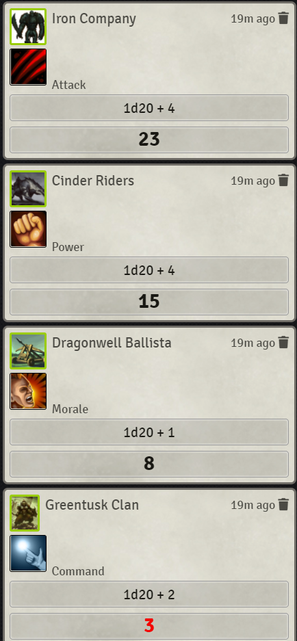
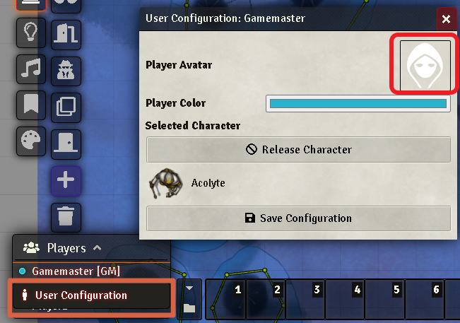
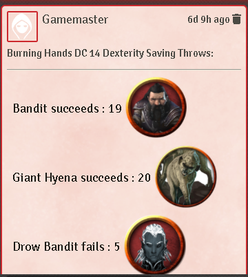
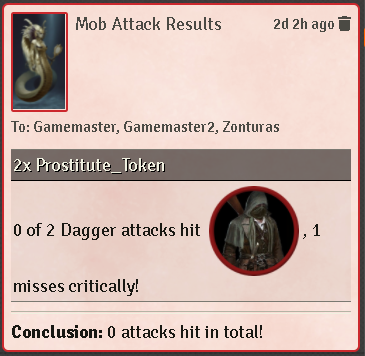
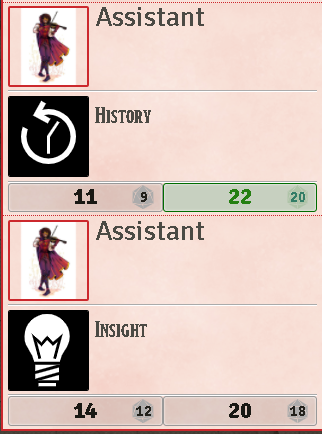
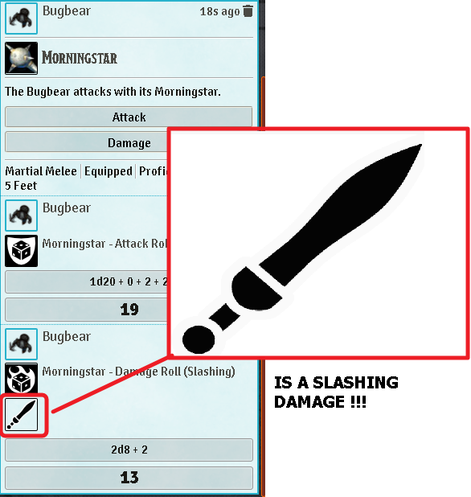

# Chat Portrait

 

[](https://forge-vtt.com/bazaar#package=chat-portrait) 


[](https://www.foundryvtt-hub.com/package/chat-portrait/)


A Foundry VTT module that displays the Actor's portrait images on the chat messages.

This is a upgrade of the project [Chat Portrait by ShoyuVanilla](https://github.com/ShoyuVanilla/FoundryVTT-Chat-Portrait) ty to [ShoyuVanilla](https://github.com/ShoyuVanilla)


## NOTE: If you are a javascript developer and not a typescript developer, you can just use the javascript files under the dist folder
## Installation

It's always easiest to install modules from the in game add-on browser.

To install this module manually:
1.  Inside the Foundry "Configuration and Setup" screen, click "Add-on Modules"
2.  Click "Install Module"
3.  In the "Manifest URL" field, paste the following url:
`https://raw.githubusercontent.com/p4535992/foundryvtt-chat-portrait/master/src/module.json`
4.  Click 'Install' and wait for installation to complete
5.  Don't forget to enable the module in game using the "Manage Module" button

## How help to make the Integration multisystem for my system ?

Since version 0.7.0, the module has been rewritten to allow for each system to have a css file to define the style and a description file of the mapping for the "ImageReplacer" feature. 

Now the community can "come" to me a little, testing the css on their browser and help me understand which combination is the best, i file css si trovano nella directory degli [styles](https://github.com/p4535992/foundryvtt-chat-portrait/blob/master/src/styles), here a example for the [dnd5e system](https://github.com/p4535992/foundryvtt-chat-portrait/blob/master/src/styles/chat-portrait-style-dnd5e.css)

So the steps to follow to create or update a system are:

1) Creation or update of the style file in the [styles](https://github.com/p4535992/foundryvtt-chat-portrait/blob/master/src/styles) directory the file must respect the `chat-portrait-style-XXX.css` nomenclature where XXX is the system id e.g. "dnd5e".
2) Creation or update of the typescript file for the mapping of the "ImageReplacer" feature if you do not want to use this feature create the file as empty and I'll take care of integrating the version with the empty arrays. **In the minimal case** you just need to copy the contents of the file [generic.ts](https://github.com/p4535992/foundryvtt-chat-portrait/blob/master/src/module/systems/generic.ts) and insert the id of your system in the property "SYSTEM_ID" remember that you have to rename the file with the system id.
3) Insert the system if absent in the configuration file [systems.ts](https://github.com/p4535992/foundryvtt-chat-portrait/blob/master/src/module/systems.ts)
4) Open a pr on contact me in some way, by open a issue ecc.

NOTE: You can use other modules like [Custom CSS](https://github.com/cswendrowski/FoundryVTT-Custom-CSS) for manage the css classes, the module help you by defining two css classes you can customize for the purpose of this module `chat-portrait-text-size-name` for the text chat message (_the 'Setup additional custom styling on the text chat message' setting_) and `chat-portrait-image-size-name` for the image prepend the text chat message (_the 'Setup additional custom styling on the image prepend the text chat message' setting_)

The module will continue to allow the use of custom CSS if desired.

## Known Issue\Limitation

- Integration multisystem it's very hard to find the time for this, for now i'm supporting only the system i use or ask by issue request, but anyone can point out what system has problem. i have prepared  a base code for support multysistem, i will not actively developing on the short term. 

- Better integration with midi-qol and CUB for their mechanism of Unknown creature, but there is no conflict because it's just css and html modification on the chat message so you can use without any issue beyween this modules

## Hooks

`ChatPortraitEnabled` is called before the interaction with the chat is executed. When any of executed hooks return `false` the interaction is aborted with the default one of foundry.


`ChatPortraitReplaceData` is called like a replacement to the standard chat portrait recovery image, so any system or GM can use a customized version for a specific module.

### Chat Portrait Custom Data

```js

const chatPortraitCustomData = {
    // url or file string reference to the image portrait path
    customIconPortraitImage,
    // [DEPRECATED use instead the 'customImageReplacerData'] Customize your own imageReplacer (Record<string,string>)
    customImageReplacer,
    // Customize your own imageReplacer ( array of {  name: string; icon: string;})
    customImageReplacerData: imageReplacerData, 
}

/// WARNING: internal data - do not use if possible
// data schema is defined in: src/module/ChatPortraitModels.ts (or module/ChatPortraitModels.js)
```

### Example

Use your own code to enable/disable the module chat-portrait...

```js

Hooks.call('ChatPortraitEnabled');
// DO SOME CHECK 'BEFORE' APPLY THE CHAT PORTRAIT STYLING

```

How you can use this on your code....

```js

Hooks.on('ChatPortraitEnabled', () => {

    // DO SOMETHING AND RETURN OR TRUE OR FALSE FOR ENABLE THE MODULE CHAT PORTRAIT
})

```

Use your own code for give me a customized image reference to put on the portrait , if you want you can give me a specific image reference for the 'Image Replacer" feature.

```js

const chatPortraitCustomData = { 
  customIconPortraitImage: "http://myimageurl/test.png", // url or file string reference to the image portrait path
  customImageReplacer: imageReplacer, // [DEPRECATED use instead the 'customImageReplacerData'] Customize your own imageReplacer (Record<string,string>)
  customImageReplacerData: imageReplacerData, // Customize your own imageReplacer ( array of {  name: string; icon: string;})
}; 

Hooks.call('ChatPortraitReplaceData', chatPortraitCustomData, chatMessage);

// and then i'll do something with `chatPortraitCustomData`

const blabla = chatPortraitCustomData;

```

How you can use this on your code....

```js

Hooks.on('ChatPortraitReplaceData', (chatPortraitCustomData, chatMessage) => {
   
    // Set your own image

    chatPortraitCustomData.customIconPortraitImage = ......

    // DO SOMETHING AND RETURN A NEW chatPortraitCustomData
    
    return chatPortraitCustomData; // this is blabla
})

```

### Full Example

```js
Hooks.on('ChatPortraitReplaceData', (chatPortraitCustomData, chatMessage) => {
	const speaker = ChatMessage.getSpeakerActor(chatMessage.data.speaker);
	if('KW_WarfareUnitSheet' === speaker?.sheet?.constructor.name) {
		chatPortraitCustomData.iconMainCustomReplacer = {
			"KW_WARFARE.Power": "systems/dnd5e/icons/skills/yellow_08.jpg",
			"KW_WARFARE.Attack": "systems/dnd5e/icons/skills/red_31.jpg",
			"KW_WARFARE.Morale": "systems/dnd5e/icons/skills/yellow_17.jpg",
			"KW_WARFARE.Command": "systems/dnd5e/icons/skills/ice_16.jpg"
		};
	}
	return chatPortraitCustomData;
});
```



## Systems

For now the following system are the only one i tested

  -  Dnd5e system
  -  PF2

any other system need some fed back from the community

## Features/Settings

- **Use Token Image**: Use the actor's Token image instead of the actor's standard image. Note: In the event the token associated with a chat message no longer exists, it will use the actor's prototype token's name. In the event the actor no longer exists, it will try to get the avatar image of the player/GM, and the original chat message's alias (usually the actor's name) to the GM.

- **Do not use Token Image with  the following type of actors** : (e.g. character, npc, ecc. separate by character ','). Remember the actor type is case sensitive. Make sense only with the setting 'Use Token Image' set to true",
 
- **Use Token Name**: Use the actor's Token name instead of the actor's standard name.

- **Use Avatar Player Image: Use the player's Avatar image instead of the token/actor standard image**. if true ignore the first option if a avatar image is not found is going back to the standard actor/token image of the 'mistery man', this option is ignored if you are the GM or else because everything you click will have the avatar image of the GM expect for the OOC chat message. NOTE: Every OOC message by default activate this mode because make sense no token must be associated with a OOC message even for player.



- **Apply chat portrait on combat tracker**: Apply the recovery of the image on the combat tracker. 

  - If you are a GM and the combatant is not owned from any player the 'Use token image' feature is enabled anyway. 
  - If you are a GM the 'Use Avatar Image feature' is ignored and the 'Use token image' feature is enabled anyway for all the tokens not owned from any player.
  - If you are NOT a GM and is enable the 'Use avatar image' feature and the player owned more than a token in combat the image is the same (the avatar image of the player)

- **Shows the name of the player next to the name of the actor for any IC messages**

- **Portrait Size (px)**: Configure portrait image size on the chat messages. Default is 36 px

- **Portrait Border Shape**: Configure border shape of the portraits displayed on the chat messages. Setting this as None disables other border options
    - Square
    - Circle
    - None

- **Use Player Color for Portrait Border**
  - Portrait Border Color
  - Portrait Border Width (px)

- **Configure portrait border width**. Default is 2 px

- **Change Color of Message Border**: Use the actor's player's color for the border of the entire chat message

- **Change Color of Message Background**: Use the actor's player's color for the background of the entire chat message


- **Display Chat Flavor Text next to Portrait**

- **Force Name Search**: If there is no Actor matching with chat message data, search for an actor of which name corresponds to the message speaker's alias. This option is needed for the compatibility with Theatre Insert module. This not work on the 'Combat Tracker feature'

- **Portrait Size for other images (px)**: Configure portrait image size for any other image on the chat message (other than the portrait one). Default is 36 px



- **Double Click on the image portrait or the name of the token "pan to token" on the current scene**

- **Configure which chat message should receive custom styling, and which ones should be left as default. Changing this may require you to refresh your window**:
  - allCards : Affect every message.
  - selfAndGM : Affect own messages and GM messages.
  - self : Only affect own messages.
  - gm : Only affect GM messages.
  - player : Only affect player messages.
  - none : Don't affect any messages.

- **Adds a textual tag to chat messages to easily identify whether the message is a whisper, blind roll, or self roll**


- **Display chat message of type OTHER**: Configure custom styling for message of type OTHER

- **Display chat message of type OOC**: Configure custom styling for message of type OOC

- **Display chat message of type IC**: Configure custom styling for message of type IC

- **Display chat message of type EMOTE**: Configure custom styling for message of type EMOTE
  
- **Display chat message of type WHISPER**: Configure custom styling for message of type WHISPER

- **Display chat message of type ROLL**: Configure custom styling for message of type ROLL
 
- **Display chat message of whisper to other**: Configure custom styling for message of whisper to other

- **Configure which cards should use the unknown custom styling, and which ones should be left as default. Changing this may require you to refresh your window**:
  - allCards : Affect every message.
  - selfAndGM : Affect own messages and GM messages.
  - self : Only affect own messages.
  - gm : Only affect GM messages.
  - player : Only affect player messages.
  - none : Don't affect any messages.
  - [DEVELOPING] onlyNpc: Affect any messages done from a NPC (need a compatible system with the 'npc' type like D&D5).


- **Placeholder for the label unknown Actor name**: by default is 'Unknown Actor' depends on the 'Display Unknown' setting

- **Placeholder for the label unknown item name**: by default is 'Unknown Item' depends on the 'Display Unknown' setting

- **Placeholder for the label unknown item icon**: by default is '/modules/chat-portrait/assets/inv-unidentified.png' depends on the 'Display Unknown' setting

~~- **[CSS CUSTOM SETTING] Setup the custom styling for the current system**: Setup additional custom styling on message with CSS language based on the feedback of the community, _Is a community effort for anyone don't know css language_ (note override any other prior property). If the settings 'Setup additional custom styling on the text chat message' or 'Setup additional custom styling on the image prepend the text chat message' is used (no blank text) this option even if true is ignored for the html elements involved. **By default is true.**~~

~~Here the table applied for the supported system :~~

~~| System id | Css for text message | Css for the image prepend the text |~~
~~|:---:|:---:|:---:|~~
~~| swade | `height: auto; display:flex;` | `height: auto; display:flex;` |~~
~~| pf2e | `display:block; margin: auto;` | `display:block; margin: auto;` |~~
~~| dnd5e | `display:flex; margin: auto;` | `display:flex; margin: auto;` |~~

~~For any correction or suggestion open a issue on this project.~~

- **[CSS CUSTOM SETTING] Setup additional custom styling on the text chat message** : Setup additional custom styling on the text chat message with CSS language (note override any other prior property)

NOTE: You can use other modules like [Custom CSS](https://github.com/cswendrowski/FoundryVTT-Custom-CSS) for manage the css classes, the module help you by defining two css classes you can customize for the purpose of this module `chat-portrait-text-size-name` for the text chat message (_the 'Setup additional custom styling on the text chat message' setting_) and `chat-portrait-image-size-name` for the image prepend the text chat message (_the 'Setup additional custom styling on the image prepend the text chat message' setting_)

- **[CSS CUSTOM SETTING] Setup additional custom styling on the image prepend the text chat message**: Setup additional custom styling on the image prepend the text chat message chat message with CSS language (note override any other prior property)

NOTE: You can use other modules like [Custom CSS](https://github.com/cswendrowski/FoundryVTT-Custom-CSS) for manage the css classes, the module help you by defining two css classes you can customize for the purpose of this module `chat-portrait-text-size-name` for the text chat message (_the 'Setup additional custom styling on the text chat message' setting_) and `chat-portrait-image-size-name` for the image prepend the text chat message (_the 'Setup additional custom styling on the image prepend the text chat message' setting_)


- **Image Replacer**: This feature for avoid the double portrait when you roll Ability / Skills / Saving Throw / Tools, for now the support is limited to the following systems :

  -  Dnd5e system
  -  PF2

If you want to add your own system it's very simple!!! you can just give to me a map of strings key=value of label and image, for a live example check out what i have done for d&d5e with the english language here a example for the dnd5e system [ImageReplacer for dnd5e](https://github.com/p4535992/foundryvtt-chat-portrait/blob/master/src/module/systems/dnd5e.ts). It's ugly but it's simple to integrated.



- **Disable the chat portrait if the alias of the chat message is from a GM**: If enable every chat message done with a alias referenced to a GM will ot apply the chat portrait mechanism

- **Set up a specific image if the alias of the chat message is from a GM**: If enable will use the image selected here for every chat message done with a alias referenced to a GM. If 'Disable the chat portrait if the alias of the chat message is from a GM' is enable this setting will be ignored


[ON DEVELOPING SO ANY SUGGESTION IS WELCOME]

- **Image Replacer Damage Types**: Add some image for better identify the type of damage of the weapon, for now the support is limited to the following systems :

  -  Dnd5e system
  -  PF2

If you want to add your own system it's very simple!!! you can just give to me a map of strings key=value of label and image, for a live example check out what i have done for d&d5e with the english language here a example for the dnd5e system [ImageReplacer for dnd5e](https://github.com/p4535992/foundryvtt-chat-portrait/blob/master/src/module/systems/dnd5e.ts). It's ugly but it's simple to integrated.



# Build

## Install all packages

```bash
npm install
```
## npm build scripts

### build

will build the code and copy all necessary assets into the dist folder and make a symlink to install the result into your foundry data; create a
`foundryconfig.json` file with your Foundry Data path.

```json
{
  "dataPath": "~/.local/share/FoundryVTT/"
}
```

`build` will build and set up a symlink between `dist` and your `dataPath`.

```bash
npm run-script build
```

### NOTE:

You don't need to build the `foundryconfig.json` file you can just copy the content of the `dist` folder on the module folder under `modules` of Foundry

### build:watch

`build:watch` will build and watch for changes, rebuilding automatically.

```bash
npm run-script build:watch
```

### clean

`clean` will remove all contents in the dist folder (but keeps the link from build:install).

```bash
npm run-script clean
```
### lint and lintfix

`lint` launch the eslint process based on the configuration [here](./.eslintrc)

```bash
npm run-script lint
```

`lintfix` launch the eslint process with the fix argument

```bash
npm run-script lintfix
```

### prettier-format

`prettier-format` launch the prettier plugin based on the configuration [here](./.prettierrc)

```bash
npm run-script prettier-format
```

### package

`package` generates a zip file containing the contents of the dist folder generated previously with the `build` command. Useful for those who want to manually load the module or want to create their own release

```bash
npm run-script package
```

## [Changelog](./changelog.md)

## Issues

Any issues, bugs, or feature requests are always welcome to be reported directly to the [Issue Tracker](https://github.com/p4535992/foundryvtt-chat-portrait/issues ), or using the [Bug Reporter Module](https://foundryvtt.com/packages/bug-reporter/).

## License

This package is under an [MIT license](LICENSE) and the [Foundry Virtual Tabletop Limited License Agreement for module development](https://foundryvtt.com/article/license/).

## Acknowledgements

Bootstrapped with League of Extraordinary FoundryVTT Developers  [foundry-vtt-types](https://github.com/League-of-Foundry-Developers/foundry-vtt-types).

Mad props to the 'League of Extraordinary FoundryVTT Developers' community which helped me figure out a lot.

## Credit

Thanks to anyone who helps me with this code! I appreciate the user community's feedback on this project!

- [foundryvtt-typescript-types](https://github.com/ShoyuVanilla/foundryvtt-typescript-types) ty to [ShoyuVanilla](https://github.com/ShoyuVanilla)
- [Chat Portrait](https://github.com/ShoyuVanilla/FoundryVTT-Chat-Portrait) ty to [ShoyuVanilla](https://github.com/ShoyuVanilla)
- [Token Chat Link](https://github.com/espositos/fvtt-tokenchatlink)
- [Deepflame's Chat Cards](https://gitlab.com/TimToxopeus/df-chat-cards)
- [Illandril's Chat Enhancements](https://github.com/illandril/FoundryVTT-chat-enhancements/)
