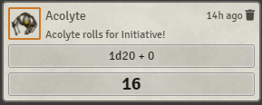
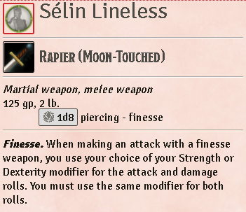

# Chat Portrait

A Foundry VTT module that displays the Actor's portrait images on the chat messages.

This is a upgrade of the project [Chat Portrait by ShoyuVanilla](https://github.comShoyuVanilla/FoundryVTT-Chat-Portrait) ty to [ShoyuVanilla](https://github.com/ShoyuVanilla)

## Installation

It's always easiest to install modules from the in game add-on browser.

To install this module manually:
1.  Inside the Foundry "Configuration and Setup" screen, click "Add-on Modules"
2.  Click "Install Module"
3.  In the "Manifest URL" field, paste the following url:
`https://raw.githubusercontent.com/ShoyuVanilla/FoundryVTT-Chat-Portrait/master/src/module.json`
1.  Click 'Install' and wait for installation to complete
2.  Don't forget to enable the module in game using the "Manage Module" button

## IMPORTANT NOTE FOR VERSION 0.2.15 AND NEWER

Like said in this issue [Name appears as "Unknown Actor" and portrait still appears when styling is disabled](https://github.com/ShoyuVanilla/FoundryVTT-Chat-Portrait/issues/40),
due to my mistake during development I didn't realize that I had badly integrated two features into one. Now I have separated the two functions at the level of the module settings, but to avoid problems you have to go and check your configurations on the module settings. I apologize for the inconvenience.

## TODO

- Integration multisystem it's very hard to find the time for this, for now i'm supporting only the system i use: Dnd5e, but anyone can point out what system has problem. i have prepared  a base code for support multysistem, but i will not actively developing on the short term. 

- Better integration with midi-qol and CUB for their mechanism of Unknown creature, but there is no conflict because it's just css and html modification on the chat message so you can use without any issue beyween this modules

## Features/Settings

- Use Token Image: Use the actor's Token image instead of the actor's standard image.

- Use Token Name: Use the actor's Token name instead of the actor's standard name.

- Portrait Size (px): Configure portrait image size on the chat messages. Default is 36 px

- Portrait Border Shape: Configure border shape of the portraits displayed on the chat messages. Setting this as None disables other border options
    - Square
    - Circle
    - None

- Use Player Color for Portrait Border
  - Portrait Border Color
  - Portrait Border Width (px)

- Configure portrait border width. Default is 2 px

- Change Color of Message Border: Use the actor's player's color for the border of the entire chat message

- Change Color of Message Background: Use the actor's player's color for the background of the entire chat message

- Display Chat Flavor Text next to Portrait

- Force Name Search: If there is no Actor matching with chat message data, search for an actor of which name corresponds to the message speaker's alias. This option is needed for the compatibility with Theatre Insert module.

- Portrait Size for item (px): Configure portrait image size for item on the chat messages. Default is 36 px

- Double Click on the image portrait or the name of the token "pan to token" on the current scene

- Use Avatar Player Image: Use the player's Avatar image instead of the token/actor standard image. Note if true ignore the first option if a avatar is found or else go back to the standard actor/token image feature, this option is ignored if you are the GM or else everything you click has the avatar image of the GM.

- Configure which chat message should receive custom styling, and which ones should be left as default. Changing this may require you to refresh your window.
  - allCards : Affect every message.
  - selfAndGM : Affect own messages and GM messages.
  - self : Only affect own messages.
  - gm : Only affect GM messages.
  - player : Only affect player messages.
  - none : Don't affect any messages.

- Configure which cards should use the unknown custom styling, and which ones should be left as default. Changing this may require you to refresh your window.
  - allCards : Affect every message.
  - selfAndGM : Affect own messages and GM messages.
  - self : Only affect own messages.
  - gm : Only affect GM messages.
  - player : Only affect player messages.
  - none : Don't affect any messages.
  - [DEVELOPING] onlyNpc: Affect any messages done from a NPC (need a compatible system with the 'npc' type like D&D5).

- Placeholder for the label unknown Actor name by default is 'Unknown Actor' depends on the 'Display Unknown' setting

- Placeholder for the label unknown item name by default is 'Unknown Item' depends on the 'Display Unknown' setting

- Placeholder for the label unknown item icon by default is '/modules/chat-portrait/assets/inv-unidentified.png' depends on the 'Display Unknown' setting

- [Passive settings] Image Replacer: This is a passive/background feature for avoid the double portrait when you roll Ability / Skills / Saving Throw / Tools, for now the support is limited to the following systems and languages :

  -  Dnd5e system with english (en) language

If you want to add your own system and/or language it's very simple!!! you can just give to me a map of strings key=value of label and image, for a live example check out what i have done for d&d5e with the english language here [ImageReplacer](https://github.com/ShoyuVanilla/FoundryVTT-Chat-Portrait/blob/master/src/module/ImageReplacer.ts). It's ugly but it's simple to integrated.

## Known issue

## [Changelog](./changelog.md)

## Issues

Any issues, bugs, or feature requests are always welcome to be reported directly to the [Issue Tracker](https://github.com/ShoyuVanilla/FoundryVTT-Chat-Portrait/issues ), or using the [Bug Reporter Module](https://foundryvtt.com/packages/bug-reporter/).

## Acknowledgements

Bootstrapped with League of Extraordinary FoundryVTT Developers  [foundry-vtt-types](https://github.com/League-of-Foundry-Developers/foundry-vtt-types).

Mad props to the 'League of Extraordinary FoundryVTT Developers' community which helped me figure out a lot.

## Credit

Thanks to anyone who helps me with this code! I appreciate the user community's feedback on this project!

- [foundryvtt-typescript-types](https://github.com/ShoyuVanilla/foundryvtt-typescript-types) ty to [ShoyuVanilla](https://github.com/ShoyuVanilla)
- [Chat Portrait](https://github.com/ShoyuVanilla/FoundryVTT-Chat-Portrait) ty to [ShoyuVanilla](https://github.com/ShoyuVanilla)
- [Token Chat Link](https://github.com/espositos/fvtt-tokenchatlink)
- [Deepflame's Chat Cards](https://gitlab.com/TimToxopeus/df-chat-cards)
- [Illandril's Chat Enhancements](https://github.com/illandril/FoundryVTT-chat-enhancements/)
